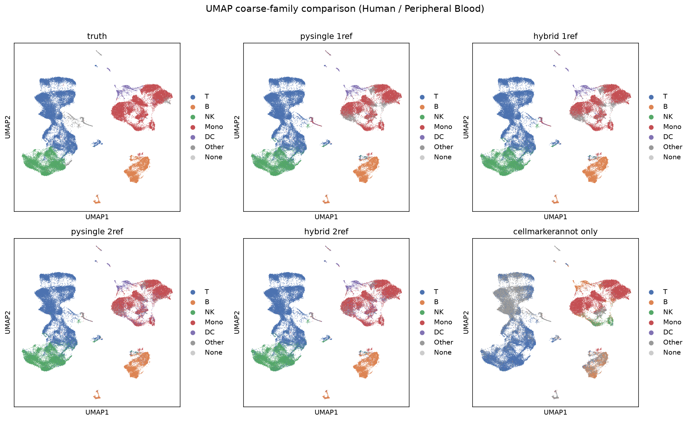
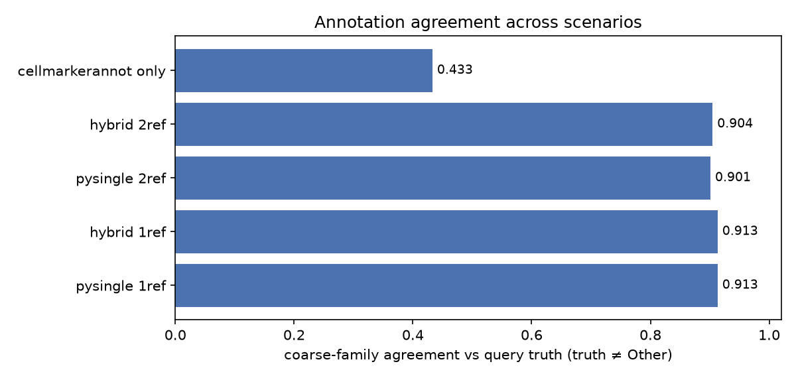
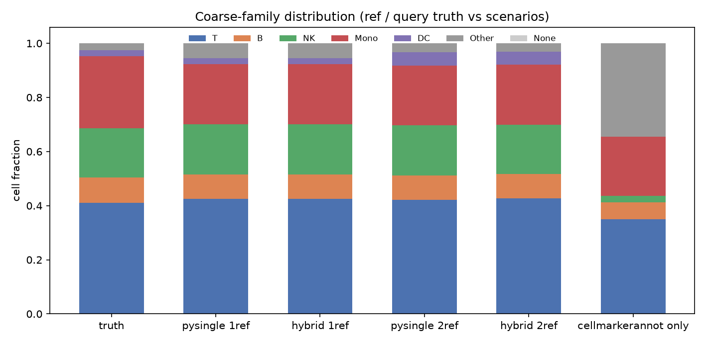
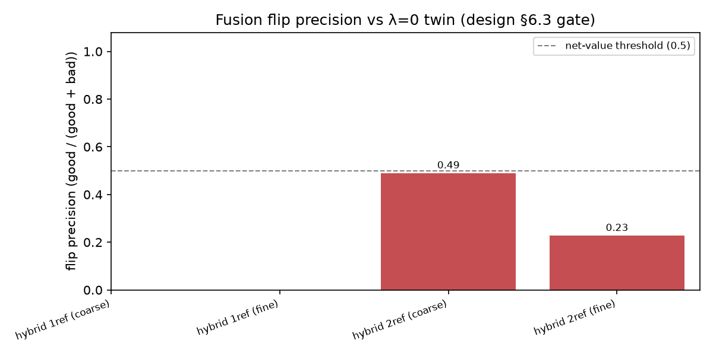
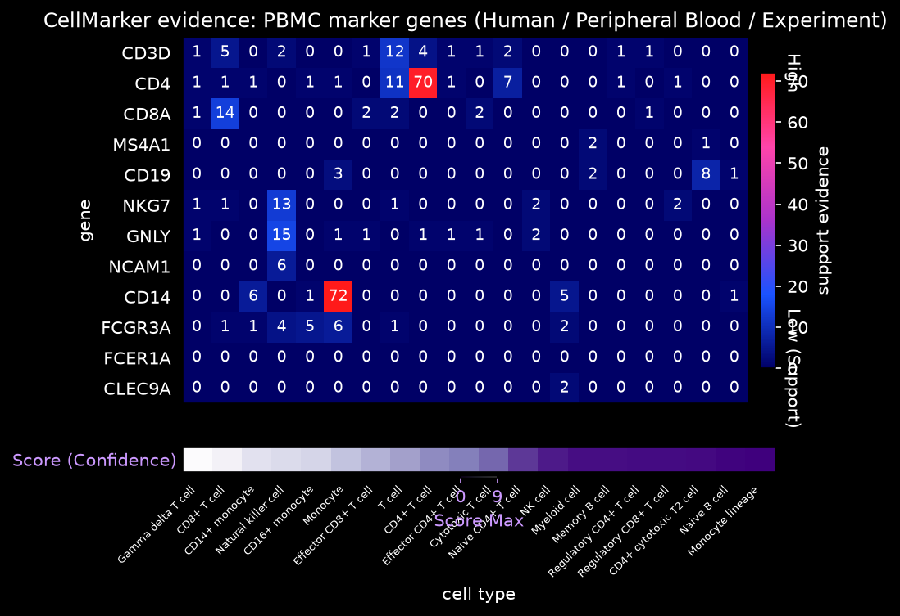
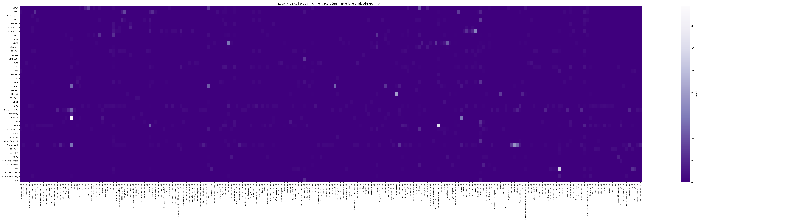
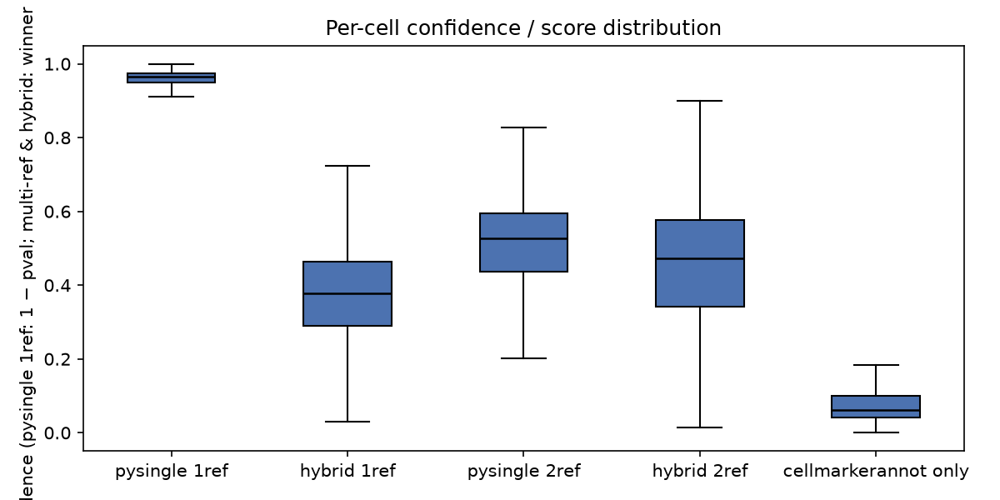
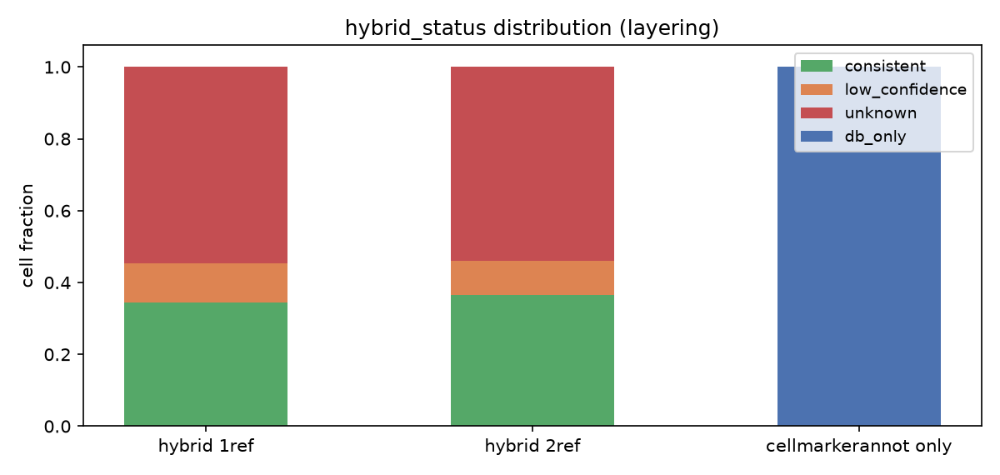
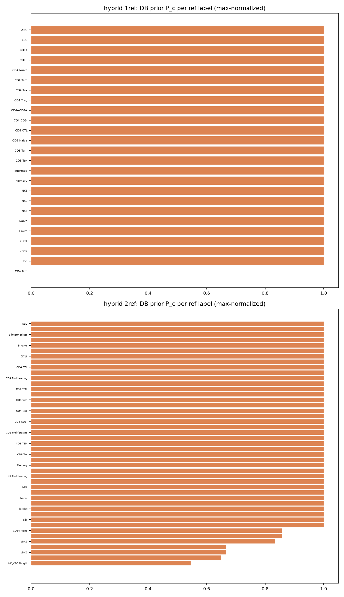

# HybridscSingleMarker

融合 **pysingle**（R 包 SingleR 的 Python 移植 + Seurat 标签转移）与
**cellmarkerannot**（CellMarker 3.0 数据库证据）的混合单细胞类型注释工具。
两套底层引擎既可独立使用，也可通过**单一 API** 组合成"参考相关 + 数据库证据"
的融合注释管线，支持单参考 / 多参考，以及无参考时的纯数据库降级。



*图 1：全量数据（58,677 个查询细胞）5 个场景 + 真值的 UMAP 粗分类族对照
（Human / Peripheral Blood / Experiment 数据源）。*

## 目标与特点

- **单一 API**：`hybrid_annotate(query, ref=None, ...)` 一步完成注释，输出
  `hybrid_celltype` / `hybrid_confidence` / `hybrid_status` 三列；`ref=None`
  自动降级为纯 CellMarker 数据库注释。
- **可组合**：`method="singler"`（SingleR 语义）或 `method="seurat"`
  （Seurat 标签转移）；`lambda_=0` 退化为纯 pysingle（内置 sanity check）。
- **多参考**：`ref` 传列表即可，跨参考按 `max` / `mean` 合并得分（对应现代
  SingleR `ref=list(...)`）。
- **规模感知**：全量 160k 参考 / 58k 查询细胞 **≈ 6–8 分钟**（profile 打分 +
  逐类型封顶 + 并行），小规模用 cells 打分保持最高精度。
- **精度治理**：每次融合输出**翻转精度闸门**（good/(good+bad)），并以
  `λ=0` 孪生对照回答"加入 CellMarker 是否有净价值"；单参考 ≥50k 自动 λ=0。
- **可解释**：每参考标签输出 `score_gene_list` 风格注释矩阵（特征基因 × DB
  细胞类型的支持证据 + 富集 Score），配套热图便于人工核对。

## 安装与配置

要求 **Python ≥ 3.12**，推荐使用 [uv](https://docs.astral.sh/uv/)：

```bash
uv sync --extra plot --extra test    # 安装全部依赖（含 matplotlib / pytest）
```

或使用 pip：

```bash
python -m venv .venv && source .venv/bin/activate
pip install -e ".[plot,test]"
```

核心依赖：`anndata`、`numpy`、`scipy`、`pandas`、`numba`、`pyarrow`、
`scikit-learn`；`matplotlib` 为可选（绘图）。`cellmarkerannot` 的 CellMarker
数据库以 zstd-Parquet 随包分发，安装后开箱即用，无需额外数据目录。

快速验证：

```bash
uv run python -c "import hybridscsinglemarker; print(hybridscsinglemarker.__version__)"
uv run pytest -q                    # 76 个测试全绿
```

> 若本机 `uv` 的缓存目录不可写（只读文件系统），可直接使用项目内已创建的
> 虚拟环境：`./.venv/bin/python scripts/hybrid_pipeline2.py ...`。

## 快速开始

### 1. 融合注释（单参考 / 多参考）

```python
import hybridscsinglemarker as hsm

# 单参考：pysingle 相关 + CellMarker 证据融合（默认 λ=0.3 + margin 门控 + 粗族先验）
out = hsm.hybrid_annotate(
    query="testdata/vkhQ8_querydata.h5ad",
    ref="testdata/pbmc50k_refdata.h5ad",
    celltype_col="celltype",
    species="Human", tissue="Blood",      # 或 "Peripheral Blood"
    data_source="experiment",             # 默认仅 Experiment 来源证据
)
out.obs[["hybrid_celltype", "hybrid_confidence", "hybrid_status"]].head()

# 多参考：ref 传列表，逐参考指定标签列
out2 = hsm.hybrid_annotate(
    query="testdata/vkhQ8_querydata.h5ad",
    ref=["testdata/pbmc50k_refdata.h5ad", "testdata/pbmc3k_refdata.h5ad"],
    celltype_col=["celltype", "celltype.l2"],
    species="Human", tissue="Blood",
)
```

### 2. 独立使用任一引擎

```python
# 只有参考数据：纯 pysingle（SingleR 语义）
out = hsm.hybrid_annotate(
    query="testdata/vkhQ8_querydata.h5ad",
    ref="testdata/pbmc50k_refdata.h5ad",
    lambda_=0.0,
)

# 只有数据库：无参考自动降级（cellmarkerannot 纯 DB 注释）
out = hsm.hybrid_annotate(
    query="testdata/vkhQ8_querydata.h5ad",
    ref=None, species="Human", tissue="Blood",
)

# 直接调用底层包（完全等价）
import hybridscsinglemarker.pysingle as pysingle
import hybridscsinglemarker.cellmarkerannot as cm

res = pysingle.annotate(ref="testdata/pbmc50k_refdata.h5ad",
                        query="testdata/vkhQ8_querydata.h5ad")
db = cm.CellMarkerDB()
scores = cm.score_cells(adata, db, species="Human", tissue="Blood")
```

### 3. 基因列表富集与证据热图

```python
mat = cm.score_gene_list(["CD3D", "CD3E", "CD4", "CD19"], db,
                         species="Human", tissue="Blood",
                         data_source="experiment")
cm.plot_gene_scores(mat, save_path="markers.png")
```

## 端到端管线（`scripts/hybrid_pipeline2.py`）

在真实 PBMC 数据上跑 5 个场景（`pysingle_1ref` / `hybrid_1ref` /
`pysingle_2ref` / `hybrid_2ref` / `cellmarkerannot_only`），输出预测、得分
矩阵、每标签注释矩阵、指标图与报告：

```bash
# 子集快速验证（ref 2000 / ref2 2000 / query 1500）
./.venv/bin/python scripts/hybrid_pipeline2.py --n-jobs 16 \
    --output-dir results/your_run

# 全量（160k ref / 58k query，profile 打分，约 6–8 分钟）
./.venv/bin/python scripts/hybrid_pipeline2.py --full --scoring profile \
    --n-jobs 32 --output-dir results/skeleton_full_profile
```

常用参数：`--fusion-mode {v_full,family_posterior}`、`--lambda`、
`--scoring {auto,cells,profile}`、`--max-cells-per-type`、
`--no-label-evidence`、`--label-heatmap-k`。

输出目录：

- `predictions.csv` — 每查询细胞 × 各场景标签 / 粗族 / 置信度 / 状态；
- `scenario_<名>_*.csv` — S0 / F / softmax / 先验 P / 验证 V 矩阵；
- `label_evidence_<scn>/<label>.csv` — 每标签 `score_gene_list` 风格注释矩阵；
- `db_evidence.csv`、`summary.json`、`report.md`；
- `figures/` — 01 分布 / 02 UMAP / 03 一致率 / 04 状态 / 05 置信度 /
  06 先验 / 07 证据热图 / 08 翻转精度 / 09 标签×DB 细胞类型 Score。

## 结果示例（全量运行）

以下图件来自 [results/skeleton_full_profile_ft/figures/](results/skeleton_full_profile_ft/figures/)，
配置：160,068 参考细胞（pbmc50k）× 58,677 查询细胞（vkhQ8），
`scoring=profile`、`max_genes=3000`、逐类型封顶 300、`n_jobs=32`、
Experiment 数据源，总耗时 **≈ 6 分钟**。

| 场景 | 粗族一致率 | 耗时 |
|---|---:|---:|
| pysingle_1ref | 0.913 | 31 s |
| hybrid_1ref（λ=0 策略） | 0.913 | 19 s |
| pysingle_2ref | 0.901 | 85 s |
| hybrid_2ref（λ=0.3 融合） | 0.904 | 147 s |
| cellmarkerannot_only | 0.433 | 5 s |

### 一致率与分布



*图 2：5 个场景的粗分类族一致率（truth ≠ Other 子集）。融合场景 ≥ 对应
pysingle 基线，且 λ=0 策略保证单参考大样本不退化。*



*图 3：真值与各场景的粗分类族分布。*

### 融合质量闸门



*图 4：hybrid vs λ=0 孪生的翻转精度（good/(good+bad)）。≥0.5 表示融合有净
价值；子集档（2k/2k/1.5k）1ref/2ref 分别为 0.78/0.81。*

### DB 证据与可解释性



*图 5：PBMC 标志基因 × 人外周血细胞类型的支持证据热图 + 富集 Score。*



*图 6：参考标签 × DB 细胞类型的富集 Score 概览（每标签一张注释矩阵 CSV 与
热图见 `label_evidence_hybrid_2ref/`）。*

### 置信度与状态分层



*图 7：各场景逐细胞置信度 / 得分分布。*



*图 8：`consistent` / `low_confidence` / `unknown` / `db_only` 状态分层。*



*图 9：每参考标签的逐细胞 DB 先验最大值（max 归一化）。*

## 算法与文档

- [Methods.md](Methods.md) — 核心算法与逻辑架构（含伪代码与流程图）；
- [cellmarker_annot.md](cellmarker_annot.md) — CellMarker 3.0 注释算法说明；
- [cellmarker_data_structure.md](cellmarker_data_structure.md) — 数据库
  22 列结构与数据质量说明；
- [cellmarker_readmd.md](cellmarker_readmd.md) — cellmarkerannot 使用说明；
- [pysingle_readme.md](pysingle_readme.md) — pysingle（SingleR/Seurat）使用说明；
- `docs/superpowers/specs/` — 骨架设计 / 验证报告 / 实施计划。

## 目录结构

```
HybridscSingleMarkerCodex/
├── pyproject.toml
├── src/hybridscsinglemarker/        # 顶层融合主包
│   ├── hybrid.py                    # hybrid_annotate 主入口
│   ├── _fusion.py                   # 先验 / 融合 / 每标签证据矩阵
│   ├── _coarse_types.py             # 粗分类族关键词映射
│   ├── _validate.py / _layer.py     # 逐细胞验证 / 状态分层
│   ├── cellmarkerannot/             # CellMarker 3.0 DB 注释子包
│   └── pysingle/                    # SingleR / Seurat 注释子包
├── scripts/
│   ├── hybrid_pipeline2.py          # 端到端验证管线
│   └── run_cellmarker_experiment.py # with/without CellMarker 增益实验
├── tests/                           # 76 个测试（TDD）
├── testdata/                        # 参考 / 查询 h5ad
└── results/                         # 管线输出与图件
```

## 开发与测试

```bash
uv run pytest -q                     # 76 passed
```

真实数据集成测试（慢速，默认排除）：

```bash
uv run pytest -m slow
```
